# Ablation H — Extended DQN Training for Stratospheric Balloon Station-Keeping

> **Looking for the pipeline, not one ablation?** See [`docs/`](docs/README.md)
> for how an ablation gets delivered end to end (ideation → implementation →
> CI → collection → PNG/GIF artifacts), the right way vs. observed pitfalls,
> the branching model, and a proposal on experiment-tracking tooling. This
> README documents Ablation H's own setup in detail below, plus an
> [Ablation Lineage](#ablation-lineage-h--p) section summarizing every
> ablation that followed it (I through P).

**Question this answers:** Was Ablation A still improving at episode 2799 because it hadn't converged, or was it close to its ceiling? Does more training close the ~4 pp gap with the heuristic baseline?

Ablation H is a direct extension of Ablation A: same plain DQN configuration (n_quantiles=1, v1 server, PER + n-step=3), with the curriculum extended from 2800 to 3600 episodes per worker — an extra 48h tier doubled to 800 episodes and a new 72h tier added.

---

## Background

The environment simulates a stratospheric balloon maintaining position over a fixed ground station (TWR50: fraction of 5-minute navigation intervals spent within 50 km of station). The physics engine runs as a persistent Node.js subprocess (`servers/balloon_env_server.mjs`), communicating with Python over NDJSON on stdin/stdout. Three wind presets test different operating conditions: `tropical`, `strong-shear`, and `calm`.

The agent chooses one of 17 discrete target altitudes every 5 minutes. The JS side applies a bang-bang chase command toward that altitude.

**State vector (20-dim):** distance/bearing to station, altitude, vertical velocity, ballast, current wind u/v, and forecast wind at 4 altitudes above.

---

## Changes vs Ablation A

| Parameter | Ablation A | Ablation H |
|-----------|-----------|-----------|
| 48h tier episodes | 400 | 800 |
| 72h tier | — | 400 eps (new) |
| Total eps/worker | 2800 | 3600 |
| n_quantiles | 1 | 1 |
| Server | v1 | v1 |
| Everything else | — | identical |

---

## Curriculum

```
2h×200  →  6h×1000  →  12h×600  →  24h×600  →  48h×800  →  72h×400
```
Total: 3600 episodes per worker. Evaluation uses 72h episodes (aligned with the new final tier).

---

## Eval metric

```
score = 0.5 × mean_TWR50 + 0.5 × worst_preset_TWR50
```

Evaluated every 300 episodes across all 3 presets × 3 runs = 9 rollouts. Ablation A baseline: **49.1%** at episode 2799.

---

## Setup

**Requirements:** Python 3.13, Node.js 22

```bash
pip install torch numpy
```

Node.js must be on `PATH` (the env spawns `node servers/balloon_env_server.mjs` per env instance).

---

## Training

### Locally

```bash
python ablate_h_train.py
```

Spawns 10 worker processes. Each worker saves its best checkpoint to `weights/dqn_ablate_h_w<id>.pt` and a companion `.json`. The global winner is written to `weights/dqn_ablate_h.pt` plus `weights/dqn_ablate_h_summary.json`. Training log: `/tmp/train_ablate_h.log`.

### Via GitHub Actions (recommended)

Trigger the **Train Ablation H** workflow from the Actions tab. It runs 10 workers in a matrix (each capped at 6 hours), then a `collect` job downloads all artifacts, picks the winner, and uploads `final-ablate-h` (retained 90 days).

```
.github/workflows/train.yml      # 10-worker matrix + collect job
.github/workflows/smoke_test.yml # quick sanity check (5 episodes)
```

To run the smoke test locally:

```bash
python run_worker.py --worker-id 0 --max-episodes 5
python collect.py
```

### Collecting results after a matrix run

After downloading all `worker-*` artifacts into `weights/`:

```bash
python collect.py
```

Prints a per-worker score table, copies the winner's `.pt` to `weights/dqn_ablate_h.pt`, and writes the summary JSON.

---

## Visualization

```bash
python replay.py                                          # all 3 presets, 72h, default weight
python replay.py --preset tropical
python replay.py --weight weights/dqn_ablate_h_w03.pt --duration 43200 --seed 7
```

Produces `replay_<preset>.png` with 5 panels: lat/lon trajectory map, altitude over time, distance from station, action distribution histogram, and action sequence.

Sample outputs (trained weights from `weights/final-ablate-h/`):

| tropical | strong-shear | calm |
|----------|-------------|------|
| 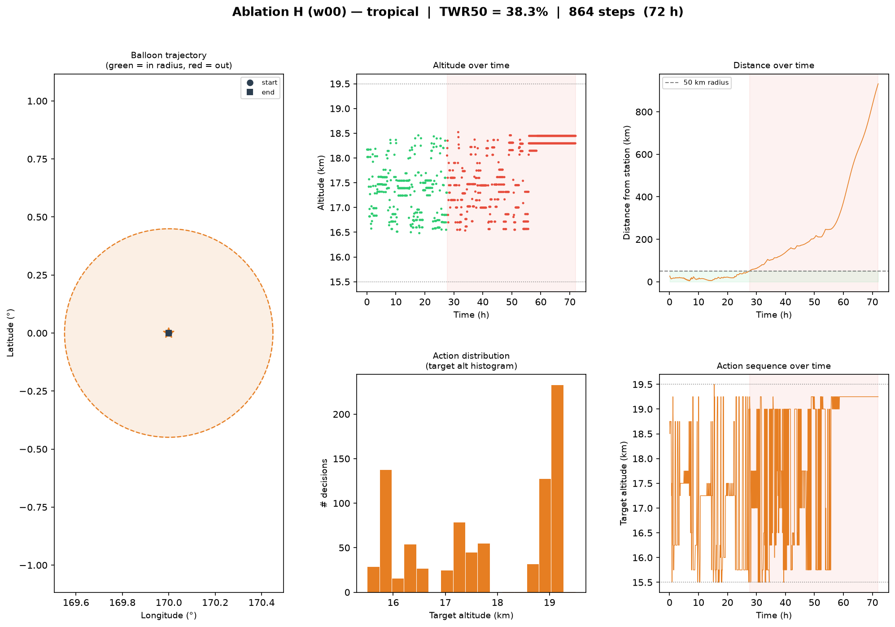 | 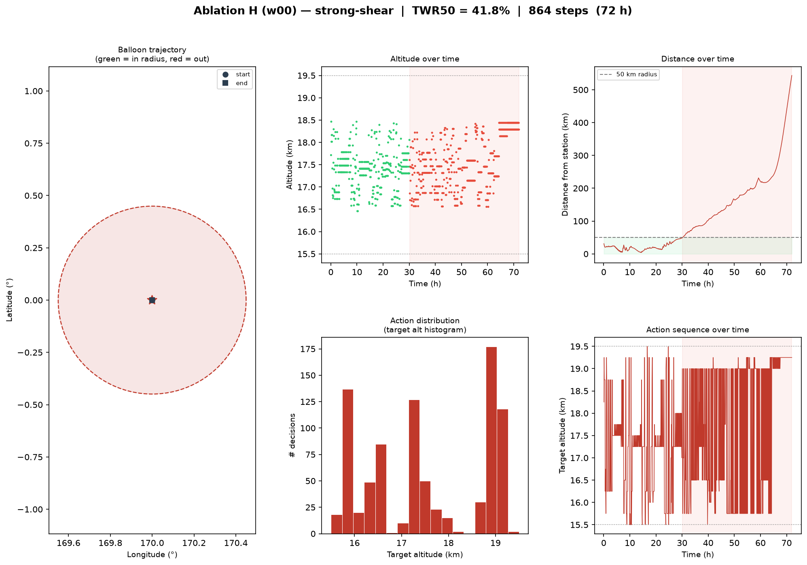 | 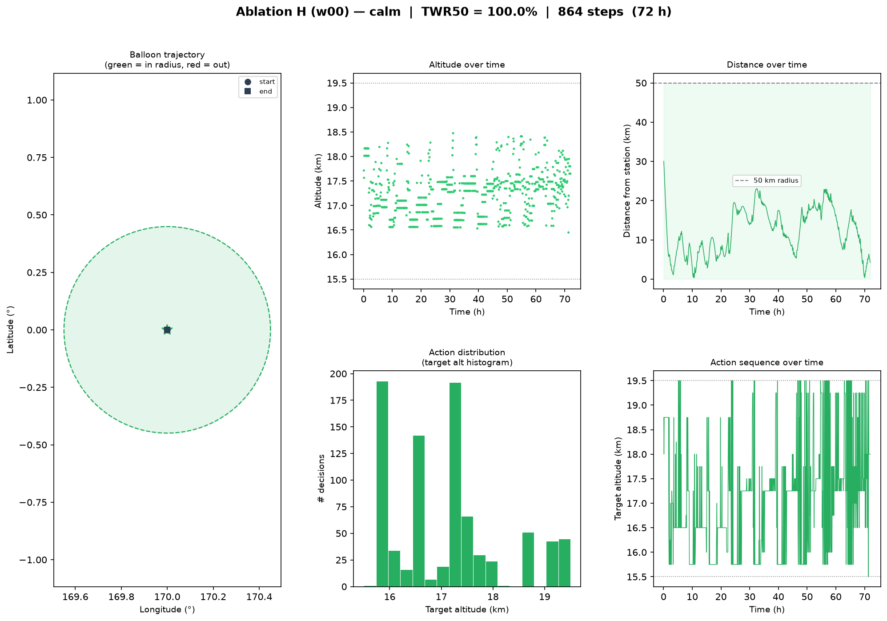 |

---

## Repository layout

```
ablate_h_train.py        # training script (local multi-process launcher)
run_worker.py            # single-worker entry point (used by CI)
collect.py               # post-run artifact aggregation + winner selection
replay.py                # eval + visualization
balloon_env.py           # Gym-style Python wrapper around the JS physics server
qr_agent.py              # QR-DQN agent (PyTorch); n_q=1 degrades to plain DQN
replay_buffer.py         # Prioritized Experience Replay + n-step accumulator
servers/
  balloon_env_server.mjs      # v1 physics engine (NDJSON over stdio)
  balloon_env_server_v2.mjs   # v2 (in-development; not used in Ablation H)
js/                      # shared JS modules (wind, balloon physics, navigator, etc.)
weights/                 # checkpoints (gitignored except final-ablate-h/)
docs/                    # pipeline architecture, delivery runbook, tooling ADR
```

---

## Hyperparameters

| Parameter | Value |
|-----------|-------|
| State dim | 20 |
| Network | 20 → 128 → 64 → 17 |
| n_quantiles | 1 (plain DQN) |
| Optimizer | Adam, lr=1e-4 |
| gamma | 0.97 |
| epsilon | 1.0 → 0.03 (decay 0.9988) |
| Target update | every 15 episodes |
| Replay capacity | 100,000 |
| Batch size | 64 |
| n-step | 3 |
| PER alpha/beta0 | 0.6 / 0.4 |
| Train batches/step | 2 |
| Workers | 10 |
| Eval every | 300 eps |
| Eval duration | 72h |

---

## Ablation Lineage (H → P)

Each ablation below is a direct descendant of the previous one (branch `ablate-<letter>-<slug>`), diagnosing and reacting to the specific failure mode the last one exposed. All use the same `score = 0.5×mean_TWR50 + 0.5×worst_preset_TWR50` metric, 10-worker CI matrix, and `replay.py`/`make_gif.py` visualization described above unless noted.

| Ablation | Key change vs. previous | Result |
|----------|--------------------------|--------|
| H | Extended A's curriculum 2800→3600 eps/worker, new 72h tier | Baseline for everything below |
| I | v2 server; linear potential shaping Φ(s)=β·max(0,1−d/D_max), D_max=500km | Station-keeps ~20h, then escapes past 700km and never returns — no shaping gradient beyond D_max |
| J | Same reward as I; 30% of 24h+ episodes spawn 150–500km from station (vs. default 30km) | Targets I's failure directly by training on recovery, not just station-keeping |
| K / K2 | Exponential shaping Φ(s)=β·exp(−d/τ), τ=500km — nonzero gradient at any distance | K had a server bug (shaping flags not passed through, τ silently fell back to 100km); K2 is the corrected re-run |
| L | 4 Fourier time-feature scalars added to state (20→24 dim): phase within the 8h internal-gravity-wave cycle and 5-day planetary-wave cycle | Lets a memoryless MLP anticipate the wind reversal that was causing escapes, rather than being surprised by it |
| M | Option-critic + GRU-64 (4 options, Bacon et al. losses) on top of L's setup | Visually purposeful multi-hour commitment in replays, but scored far below L on a clean re-eval (24.7% vs L's 46.9%, 10-seed) with high seed variance — traced to a bundled lr/batch-size change and no gradient clipping (see O) |
| N | Kept L's Fourier features (no option-critic); γ 0.97→0.99 (TD horizon ~6.25h→~19h), target-update 15→25, curriculum rebalanced toward longer episodes (≥24h share 50%→69%) | 51.8% best score, 10 workers — long enough horizon to back-propagate an 8h IGW reversal into today's decision |
| O | Reverts M's bundled lr (3e-4→1e-4) and batch_size (32→64) changes, adds `grad_clip_norm=5.0`, raises `oc_term_reg` 0.01→0.05 — otherwise M's exact architecture | Regressed *below* M — bundling 4 changes at once made the actual cause unidentifiable |
| P | Isolates gradient clipping as the only variable vs. M (`grad_clip_norm` None→5.0, everything else identical to M) | A local gradient-norm probe (948 steps, max 1.26) ruled out clipping itself as O's regression cause — the likely real culprit is M/O's per-episode training cadence producing ~36× fewer gradient steps than L's per-step cadence |

**Caveats before trusting any specific score above:**
- **Ablation I's committed weights are a smoke-test artifact, not a real result.** `weights/dqn_ablate_i_summary.json` shows `n_workers: 1`, `best_episode: 4` — a 5-episode sanity check that happens to write to the same filename as a real 3600-episode run. Its `best_score` (6.9%) is a near-random policy, not I's actual performance.
- **M's own training-time eval score is epsilon-contaminated** (an eval epsilon-greedy leak fixed in N) — use the clean 10-seed re-eval cited above (24.7%) for M, not the number in its own `dqn_ablate_m_summary.json`.
- Several ablation branches have had their history rewritten since training — e.g. `ablate-j-recovery-spawn`'s current tip no longer contains the commit that was actually built and trained for Ablation J (`0123b86`, confirmed via the CI run's pinned `head_sha`), even though `weights/dqn_ablate_j.pt` is the genuine trained artifact from that run. See `docs/architecture/ablation-pipeline.md` (Failure Modes) for the full list of these gaps.
- I through N were re-run locally (seed 42, 72h, greedy eval) to regenerate `replay_ablate_<letter>_<preset>.{png,gif}` with a Q-value/V(s) diagnostic panel; those single-seed TWR50s will differ slightly from the multi-seed CI scores in the table above.

---

## Sample Replays (I → N)

72h greedy-eval rollouts (seed 42) per ablation × preset, generated by `replay.py`/`make_gif.py`. GIFs animate the balloon's live position and overlay the agent's own V(s) value estimate against the raw step reward (see [Ablation Lineage](#ablation-lineage-h--p) caveats above before reading I's numbers). I has no GIF — `make_gif.py`'s `ENV_FLAGS` doesn't cover it, and its weights are a smoke-test artifact anyway.

### Ablation I (linear shaping — smoke-test weights, see caveat)

| tropical | strong-shear | calm |
|----------|-------------|------|
| 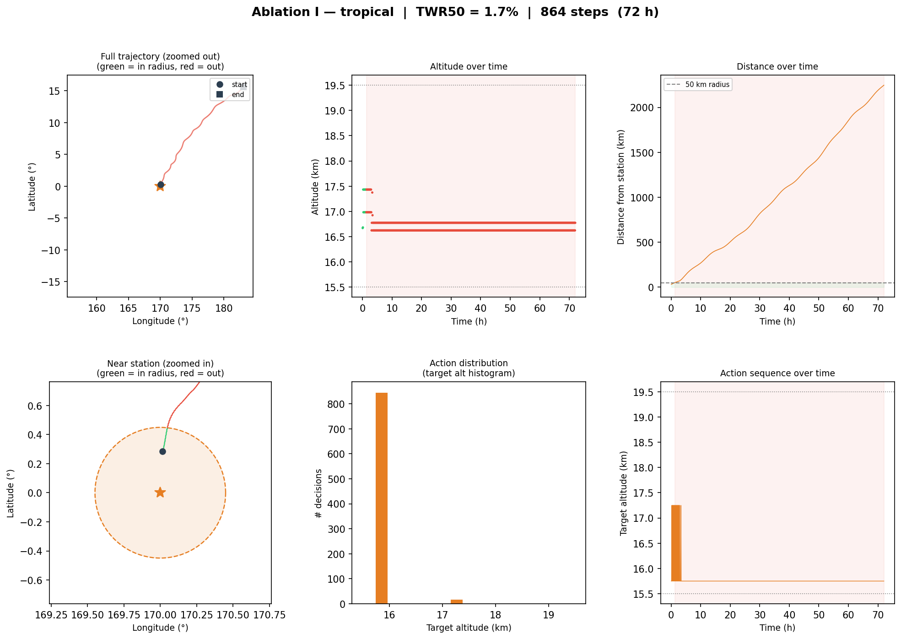 | 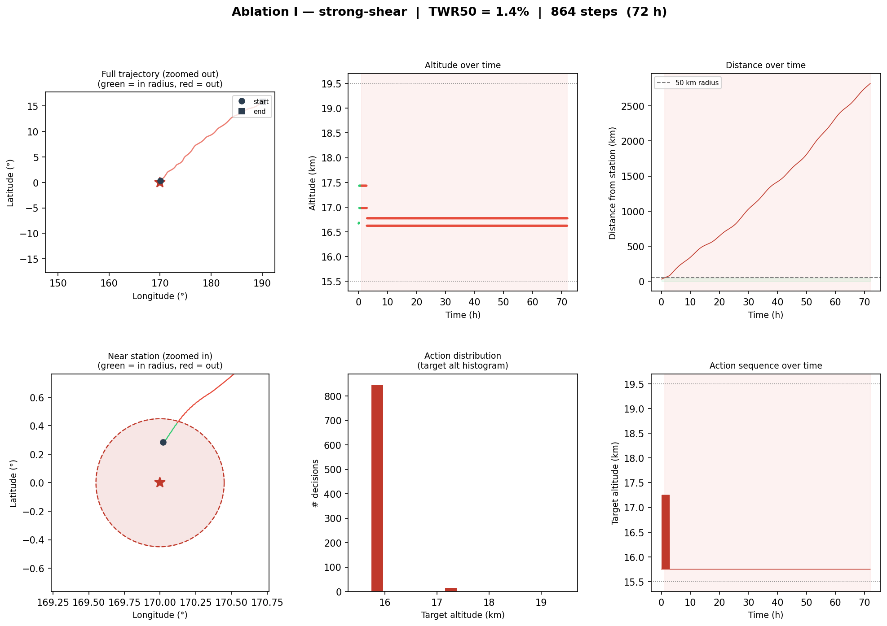 | 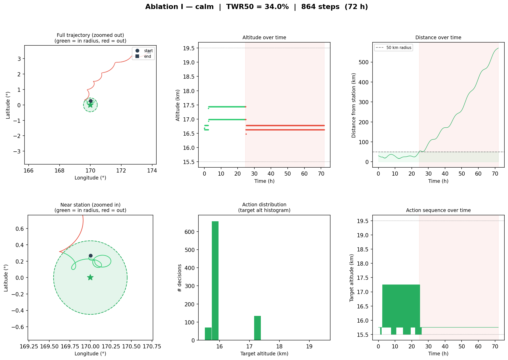 |

### Ablation J (recovery spawn)

| tropical | strong-shear | calm |
|----------|-------------|------|
| 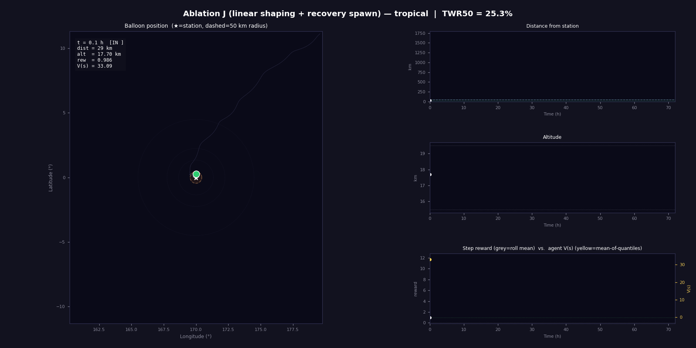 | 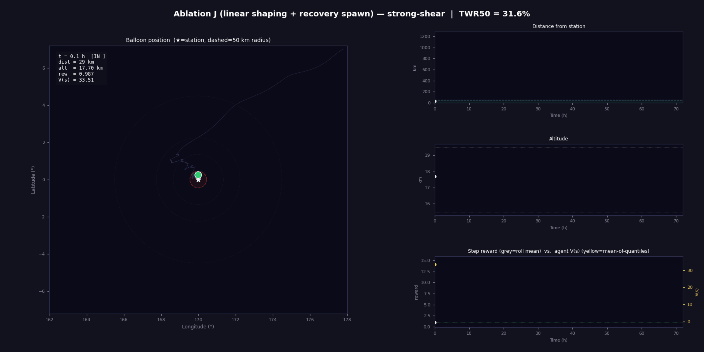 | 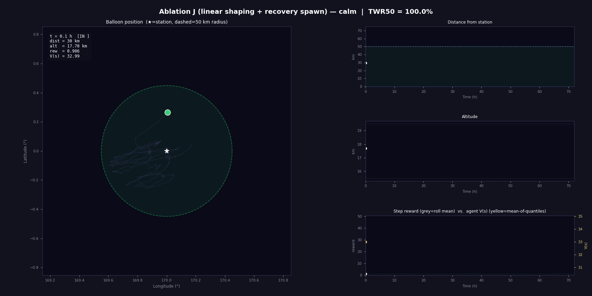 |

### Ablation K2 (exponential shaping, τ=500km)

| tropical | strong-shear | calm |
|----------|-------------|------|
| 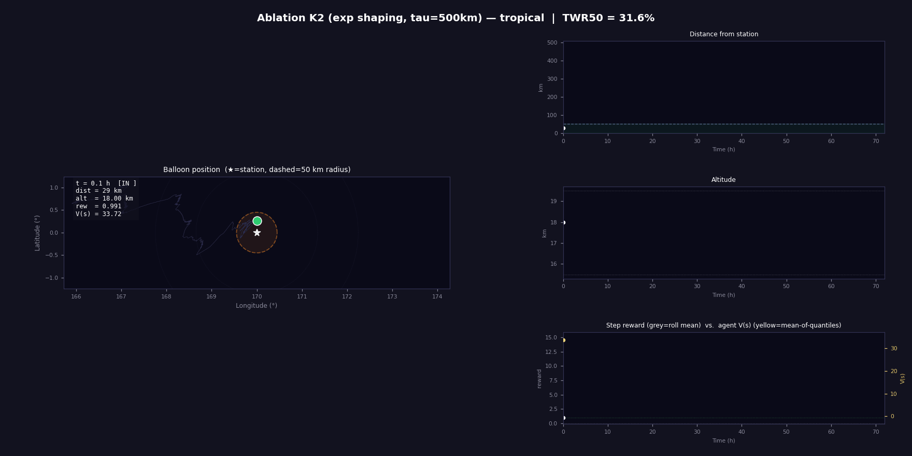 | 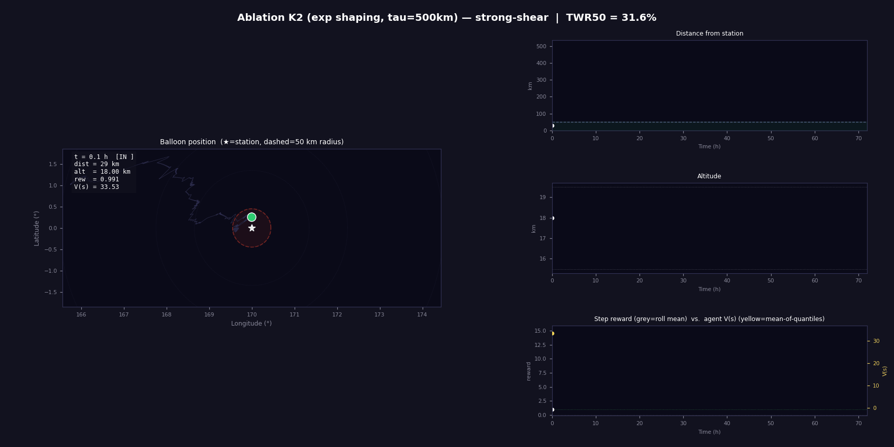 | 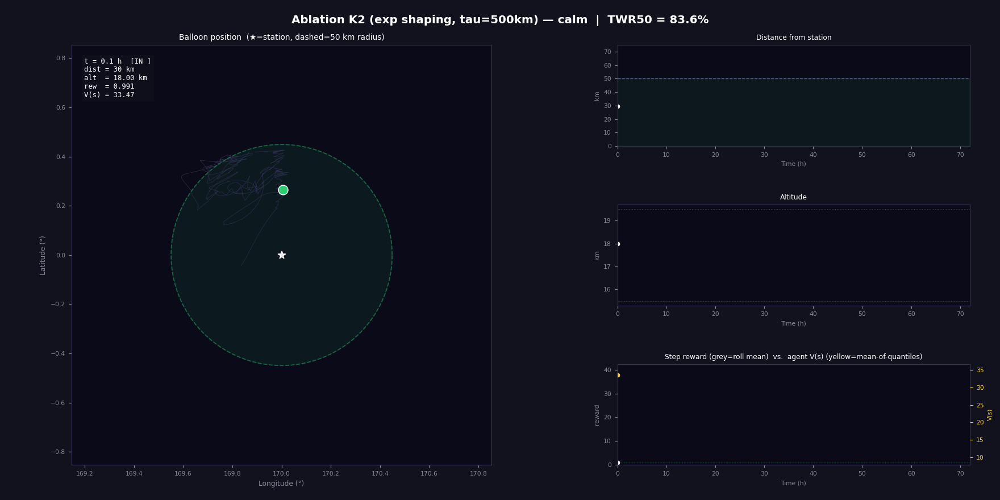 |

### Ablation L (Fourier time features)

| tropical | strong-shear | calm |
|----------|-------------|------|
| 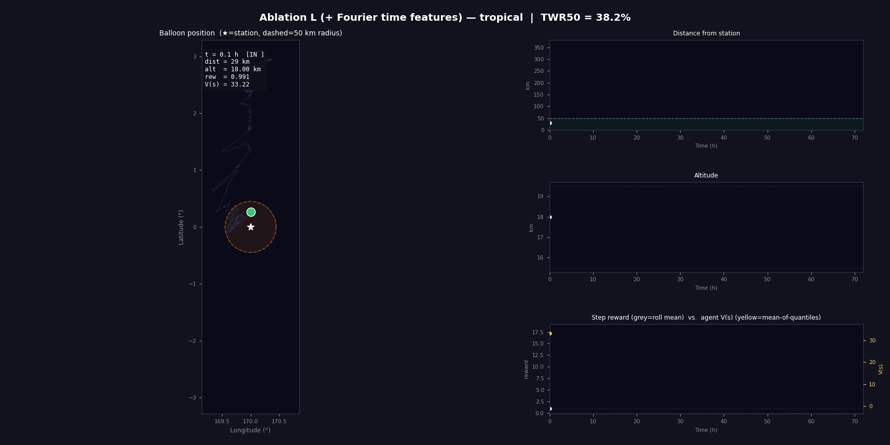 | 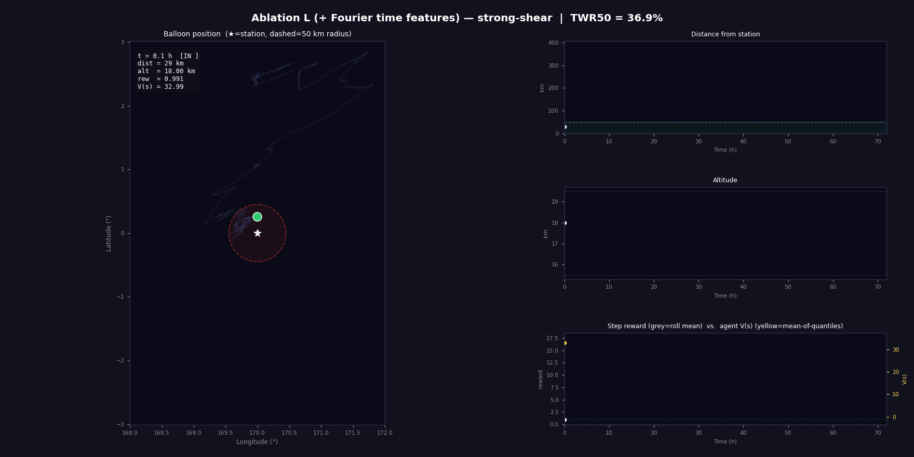 | 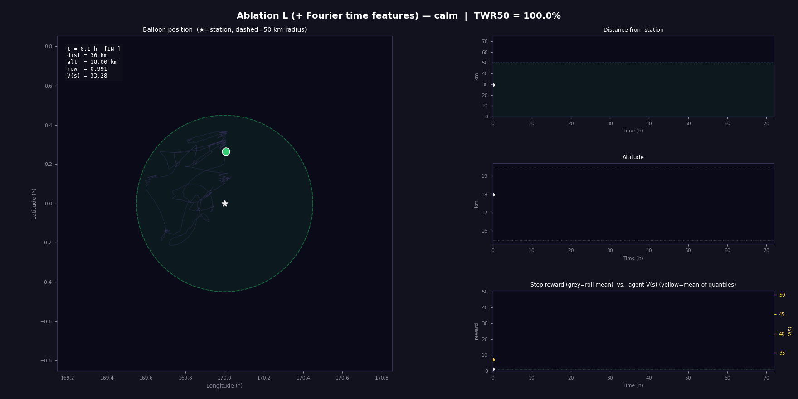 |

### Ablation M (option-critic + GRU-64)

| tropical | strong-shear | calm |
|----------|-------------|------|
| 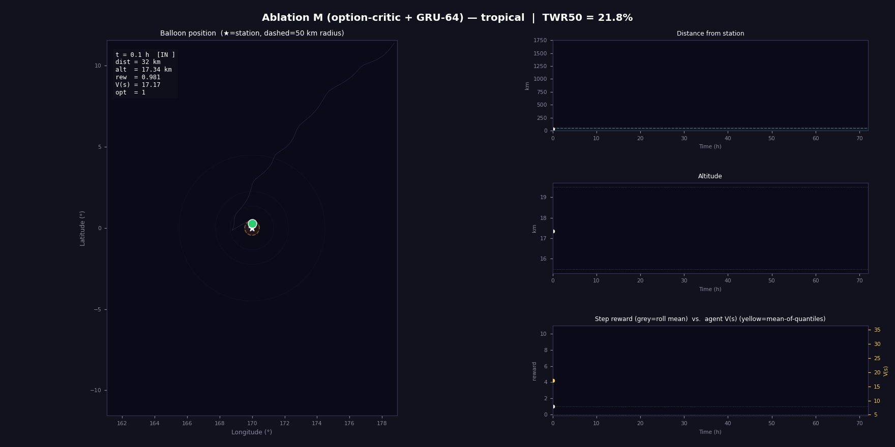 | 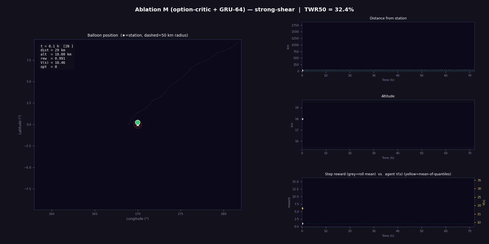 | 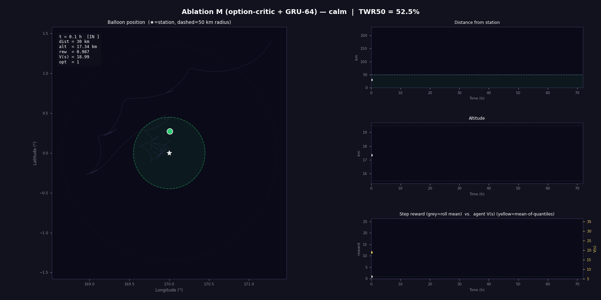 |

### Ablation N (γ=0.99 + curriculum rebalance)

| tropical | strong-shear | calm |
|----------|-------------|------|
|  | 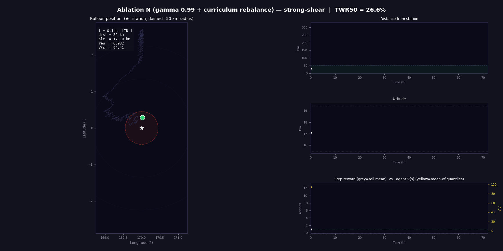 | 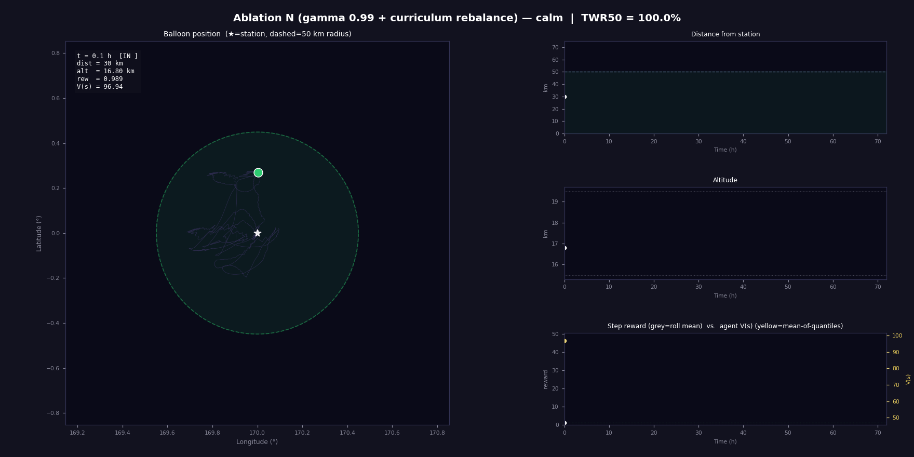 |
