# Ablation H — Extended DQN Training for Stratospheric Balloon Station-Keeping

> **Looking for the pipeline, not one ablation?** See [`docs/`](docs/README.md)
> for how an ablation gets delivered end to end (ideation → implementation →
> CI → collection → PNG/GIF artifacts), the right way vs. observed pitfalls,
> the branching model, and a proposal on experiment-tracking tooling. This
> README documents Ablation H's own setup in detail below, plus an
> [Ablation Lineage](#ablation-lineage-h--q) section summarizing every
> ablation that followed it (I through Q).

**Question this answers:** Was Ablation A still improving at episode 2799 because it hadn't converged, or was it close to its ceiling? Does more training close the ~4 pp gap with the heuristic baseline?

Ablation H is a direct extension of Ablation A: same plain DQN configuration (n_quantiles=1, v1 server, PER + n-step=3), with the curriculum extended from 2800 to 3600 episodes per worker — an extra 48h tier doubled to 800 episodes and a new 72h tier added.

---

## Background

The environment simulates a stratospheric balloon maintaining position over a fixed ground station (TWR50: fraction of 5-minute navigation intervals spent within 50 km of station). The physics engine runs as a persistent Node.js subprocess (`servers/balloon_env_server.mjs`), communicating with Python over NDJSON on stdin/stdout. Three wind presets test different operating conditions: `tropical`, `strong-shear`, and `calm`.

The agent chooses one of 17 discrete target altitudes every 5 minutes. The JS side applies a bang-bang chase command toward that altitude.

**State vector (20-dim):** distance/bearing to station, altitude, vertical velocity, ballast, current wind u/v, and forecast wind at 4 altitudes above.

---

## Changes vs Ablation A

| Parameter | Ablation A | Ablation H |
|-----------|-----------|-----------|
| 48h tier episodes | 400 | 800 |
| 72h tier | — | 400 eps (new) |
| Total eps/worker | 2800 | 3600 |
| n_quantiles | 1 | 1 |
| Server | v1 | v1 |
| Everything else | — | identical |

---

## Curriculum

```
2h×200  →  6h×1000  →  12h×600  →  24h×600  →  48h×800  →  72h×400
```
Total: 3600 episodes per worker. Evaluation uses 72h episodes (aligned with the new final tier).

---

## Eval metric

```
score = 0.5 × mean_TWR50 + 0.5 × worst_preset_TWR50
```

Evaluated every 300 episodes across all 3 presets × 3 runs = 9 rollouts. Ablation A baseline: **49.1%** at episode 2799.

---

## Setup

**Requirements:** Python 3.13, Node.js 22

```bash
pip install torch numpy
```

Node.js must be on `PATH` (the env spawns `node servers/balloon_env_server.mjs` per env instance).

---

## Training

### Locally

```bash
python ablate_h_train.py
```

Spawns 10 worker processes. Each worker saves its best checkpoint to `weights/dqn_ablate_h_w<id>.pt` and a companion `.json`. The global winner is written to `weights/dqn_ablate_h.pt` plus `weights/dqn_ablate_h_summary.json`. Training log: `/tmp/train_ablate_h.log`.

### Via GitHub Actions (recommended)

Trigger the **Train Ablation H** workflow from the Actions tab. It runs 10 workers in a matrix (each capped at 6 hours), then a `collect` job downloads all artifacts, picks the winner, and uploads `final-ablate-h` (retained 90 days).

```
.github/workflows/train.yml      # 10-worker matrix + collect job
.github/workflows/smoke_test.yml # quick sanity check (5 episodes)
```

To run the smoke test locally:

```bash
python run_worker.py --worker-id 0 --max-episodes 5
python collect.py
```

### Collecting results after a matrix run

After downloading all `worker-*` artifacts into `weights/`:

```bash
python collect.py
```

Prints a per-worker score table, copies the winner's `.pt` to `weights/dqn_ablate_h.pt`, and writes the summary JSON.

---

## Visualization

```bash
python replay.py                                          # all 3 presets, 72h, default weight
python replay.py --preset tropical
python replay.py --weight weights/dqn_ablate_h_w03.pt --duration 43200 --seed 7
```

Produces `replay_<preset>.png` with 5 panels: lat/lon trajectory map, altitude over time, distance from station, action distribution histogram, and action sequence.

Sample outputs (trained weights from `weights/final-ablate-h/`):

| tropical | strong-shear | calm |
|----------|-------------|------|
| 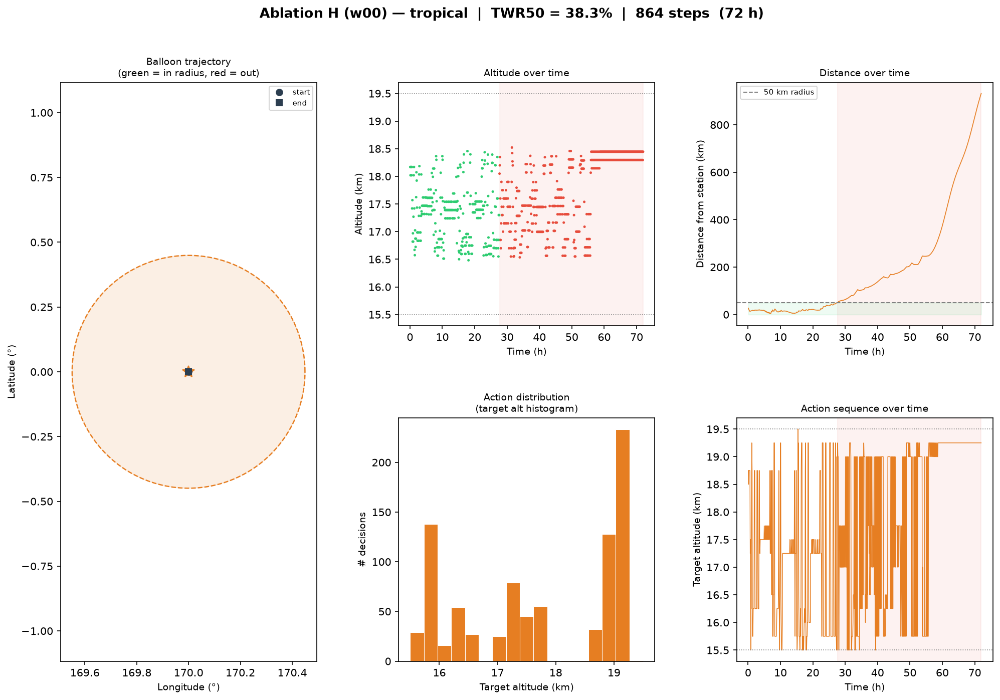 | 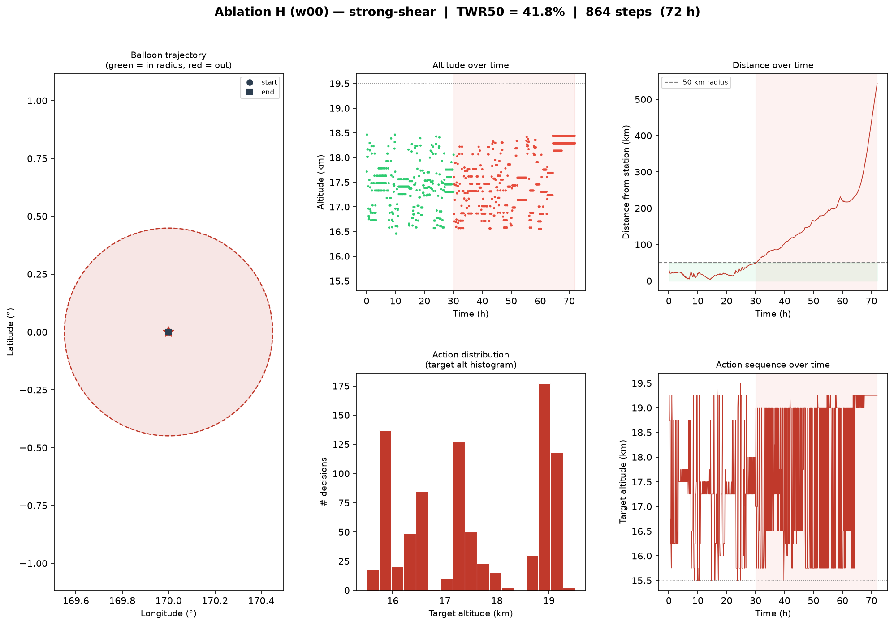 | 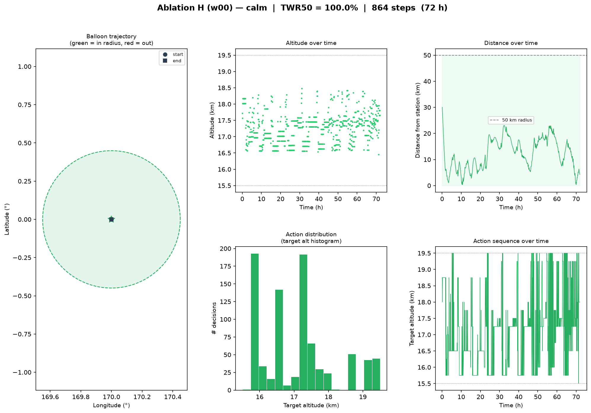 |

---

## Repository layout

```
ablate_h_train.py        # training script (local multi-process launcher)
run_worker.py            # single-worker entry point (used by CI)
collect.py               # post-run artifact aggregation + winner selection
replay.py                # eval + visualization
balloon_env.py           # Gym-style Python wrapper around the JS physics server
qr_agent.py              # QR-DQN agent (PyTorch); n_q=1 degrades to plain DQN
replay_buffer.py         # Prioritized Experience Replay + n-step accumulator
servers/
  balloon_env_server.mjs      # v1 physics engine (NDJSON over stdio)
  balloon_env_server_v2.mjs   # v2 (in-development; not used in Ablation H)
js/                      # shared JS modules (wind, balloon physics, navigator, etc.)
weights/                 # checkpoints (gitignored except final-ablate-h/)
docs/                    # pipeline architecture, delivery runbook, tooling ADR
```

---

## Hyperparameters

| Parameter | Value |
|-----------|-------|
| State dim | 20 |
| Network | 20 → 128 → 64 → 17 |
| n_quantiles | 1 (plain DQN) |
| Optimizer | Adam, lr=1e-4 |
| gamma | 0.97 |
| epsilon | 1.0 → 0.03 (decay 0.9988) |
| Target update | every 15 episodes |
| Replay capacity | 100,000 |
| Batch size | 64 |
| n-step | 3 |
| PER alpha/beta0 | 0.6 / 0.4 |
| Train batches/step | 2 |
| Workers | 10 |
| Eval every | 300 eps |
| Eval duration | 72h |

---

## Ablation Lineage (H → Q)

Each ablation below is a direct descendant of the previous one (branch `ablate-<letter>-<slug>`), diagnosing and reacting to the specific failure mode the last one exposed. All use the same `score = 0.5×mean_TWR50 + 0.5×worst_preset_TWR50` metric, 10-worker CI matrix, and `replay.py`/`make_gif.py` visualization described above unless noted.

| Ablation | Key change vs. previous | Result |
|----------|--------------------------|--------|
| H | Extended A's curriculum 2800→3600 eps/worker, new 72h tier | Baseline for everything below |
| I | v2 server; linear potential shaping Φ(s)=β·max(0,1−d/D_max), D_max=500km | Station-keeps ~20h, then escapes past 700km and never returns — no shaping gradient beyond D_max |
| J | Same reward as I; 30% of 24h+ episodes spawn 150–500km from station (vs. default 30km) | Targets I's failure directly by training on recovery, not just station-keeping |
| K / K2 | Exponential shaping Φ(s)=β·exp(−d/τ), τ=500km — nonzero gradient at any distance | K had a server bug (shaping flags not passed through, τ silently fell back to 100km); K2 is the corrected re-run |
| L | 4 Fourier time-feature scalars added to state (20→24 dim): phase within the 8h internal-gravity-wave cycle and 5-day planetary-wave cycle | Lets a memoryless MLP anticipate the wind reversal that was causing escapes, rather than being surprised by it |
| M | Option-critic + GRU-64 (4 options, Bacon et al. losses) on top of L's setup | Visually purposeful multi-hour commitment in replays, but scored far below L on a clean re-eval (24.7% vs L's 46.9%, 10-seed) with high seed variance — traced to a bundled lr/batch-size change and no gradient clipping (see O) |
| N | Kept L's Fourier features (no option-critic); γ 0.97→0.99 (TD horizon ~6.25h→~19h), target-update 15→25, curriculum rebalanced toward longer episodes (≥24h share 50%→69%) | 51.8% best score, 10 workers — long enough horizon to back-propagate an 8h IGW reversal into today's decision |
| O | Reverts M's bundled lr (3e-4→1e-4) and batch_size (32→64) changes, adds `grad_clip_norm=5.0`, raises `oc_term_reg` 0.01→0.05 — otherwise M's exact architecture | Regressed *below* M — bundling 4 changes at once made the actual cause unidentifiable |
| P | Isolates gradient clipping as the only variable vs. M (`grad_clip_norm` None→5.0, everything else identical to M) | A local gradient-norm probe (948 steps, max 1.26) ruled out clipping itself as O's regression cause — the likely real culprit is M/O's per-episode training cadence producing ~36× fewer gradient steps than L's per-step cadence |
| Q | Tests P's cadence theory: M's exact architecture with L's optimization recipe — per-step training (1 grad step / 2 env steps, ~8× M's gradient count), lr 3e-4→1e-4, target-update 30→15, no clipping | Clean 10-seed re-eval **25.0%** — statistically identical to M's 24.7% despite 8× the gradients (best worker 37.9%, worker mean 24.4% ± 10 pp; L = 46.9%). The cadence theory is dead: this is direct evidence against option-critic itself on this problem. Realism transfer probe: Q drops 25.0%→13.6% (−11.4 pp) with the wind clock broken, vs N's 46.1%→16.0% (−30.1 pp) — the GRU wasn't more robust, it just had less clock-reading skill to lose |

**Caveats before trusting any specific score above:**
- **Ablation I's committed weights are a smoke-test artifact, not a real result.** `weights/dqn_ablate_i_summary.json` shows `n_workers: 1`, `best_episode: 4` — a 5-episode sanity check that happens to write to the same filename as a real 3600-episode run. Its `best_score` (6.9%) is a near-random policy, not I's actual performance.
- **M's own training-time eval score is epsilon-contaminated** (an eval epsilon-greedy leak fixed in N) — use the clean 10-seed re-eval cited above (24.7%) for M, not the number in its own `dqn_ablate_m_summary.json`.
- Several ablation branches have had their history rewritten since training — e.g. `ablate-j-recovery-spawn`'s current tip no longer contains the commit that was actually built and trained for Ablation J (`0123b86`, confirmed via the CI run's pinned `head_sha`), even though `weights/dqn_ablate_j.pt` is the genuine trained artifact from that run. See `docs/architecture/ablation-pipeline.md` (Failure Modes) for the full list of these gaps.
- I through N were re-run locally (seed 42, 72h, greedy eval) to regenerate `replay_ablate_<letter>_<preset>.{png,gif}` with a Q-value/V(s) diagnostic panel; those single-seed TWR50s will differ slightly from the multi-seed CI scores in the table above.

---

## Realism Era (R / S / T)

The H→Q lineage trained in an env whose IGW/PW wind phases are functions of absolute episode time — an oracle "wind clock" that L/N read via Fourier time features. `probe_realism_transfer.py` showed most of that skill does not survive contact with reality: with phases randomized, N drops 46.1%→16.0% composite and Q drops 25.0%→13.6% (10 seeds × 72h).

R, S, and T therefore train **in** a realism testbed (branch `ablate-r-realism-env` + one-delta branches): four flag-gated env changes ON for both training and eval — `wind_phase_jitter`, `wind_episode_noise`, `wind_param_jitter`, `domain_rand` (the flags-off path is proven bit-identical to legacy, so H→Q remain reproducible). **Scores below are NOT comparable to the H→Q table** — same metric, harder env; the transfer probe is the only cross-env bridge. The three arms vary only the agent's information structure:

**Scoring methodology — in-run scores are winner's-cursed here.** Under the realism flags, per-episode difficulty varies enormously (per-seed TWR50 stdev ±31–38 pp, vs ±3–11 pp legacy), so a "best checkpoint" selected across ~12 in-run evals × 10 workers overstates true skill by ~1.7× (R: 64.2% in-run → 38.4% clean). All headline comparisons below therefore use a clean re-eval of each arm's winner checkpoint: 10 fixed seeds (42 + i·1,000,003) × 3 presets × 72h, greedy, composite = 0.5·mean + 0.5·worst-preset. Identical seeds across arms allow per-episode *paired* deltas, which cancel most of the episode-difficulty noise. Raw JSONs: `weights/dqn_ablate_{r,s,t}_reeval.json`.

| Ablation | Arm (information structure) | Clean composite — realism / legacy | In-run winner / worker mean (inflated — see above) |
|---|---|---|---|
| R | Floor: N's recipe, no time features (state 20-dim) — no phase information at all | **38.4% / 40.4%** | 64.2% / 44.9% ± 8.8 pp |
| S | Estimation: `use_estimated_phase_features` — online demodulation of GPS-drift wind residuals → 4 real-life-computable phase features (state 24-dim) | **37.8% / 38.5%** | 57.3% / 50.5% ± 5.7 pp |
| T | Memory: GRU-64 (`use_recurrent=True`, no options) with R2D2-style sequence replay (burn-in 16 + train 16), Q's per-step cadence | **20.7% / 12.0%** | 41.4% / 30.4% ± 6.6 pp |

**Readout vs the pre-registered decision rules** (S ≫ R ⇒ estimation recovers the oracle; T ≈ S ⇒ memory learns phase inference; T ≈ R ⇒ memory fails to; all ≈ R ⇒ phase wasn't load-bearing):

- **S ≈ R, almost exactly** — paired per-episode delta −1.7 pp ± 5.2 SE (t = −0.33, n = 30). The estimator itself works (it locks to a few degrees of phase error within hours), but there is no oracle-sized contribution left to recover: once the env stops rewarding clock-reading, phase information is not the load-bearing ingredient. This is the "all ≈ R" branch. R still passes the step-4 sanity check either way — 38.4% clean is far above the ~7% random floor and the 16% transfer bound.
- **T ≪ R** — paired delta −19.4 pp ± 5.7 SE (t = −3.4; T wins 6 / loses 23 of 30 paired episodes), and −38.8 pp (t = −6.7) in the legacy env, where T sits near the random floor (tropical 8.6%). The memory arm doesn't merely fail to learn phase inference: recurrent training roughly *halves* the feedforward floor's score, extending the M/O/P/Q pattern — recurrent/option machinery has never paid for itself on this problem. Caveats: T's 2h curriculum tier (24 nav steps < the 32-step sequence window) contributes no gradient steps (100 of 3600 episodes, inherited from Q's machinery), and the clean comparison evaluates one winner checkpoint per arm — but the in-run worker means (T 30.4% vs R 44.9%, 10 workers each under the same selection protocol) independently corroborate the gap.
- **R and S are env-invariant** (realism ≈ legacy composite, ~38–40% both), unlike N (46.1% legacy → 16.0% realism). Training under realism produces policies whose skill survives losing the wind clock — an honest ~38% instead of N's illusory 46%.

### How this squares with the literature — and what a fair recurrence rematch would take

Both verdicts match the strongest real-world evidence available (surveyed 2026-07):

- **Google Loon's deployed controller was feedforward + engineered estimation — the "S strategy" at planetary scale.** The Nature 2020 controller ([Bellemare et al.](https://www.nature.com/articles/s41586-020-2939-8)) — the system this repo's task, TWR50 metric, and QR-DQN agent are modeled on — used a feed-forward network (seven layers of 600 ReLU units, QR-DQN) with **no recurrence**, despite the real problem being far more partially observable than this sim (wind is measurable only at the balloon's own altitude). Partial observability was handled the way S does it: an engineered estimator — a Gaussian process blending the balloon's wind measurements with ECMWF forecasts — whose per-altitude wind estimates *and their uncertainties* (181 pressure levels) were fed to the network as inputs. Their controller reached 55.1% TWR50 against an estimated ~56.8% effective ceiling: a memoryless net with belief-state inputs was near-optimal, leaving learned memory at most ~2 pp of headroom, at Google scale.
- **No published recurrent agent beats the feedforward baseline on Google's open benchmark.** The [Balloon Learning Environment](https://github.com/google/balloon-learning-environment)'s state-of-the-art agent (Perciatelli44) is the same feedforward QR-DQN; we found no recurrent or transformer agent surpassing it in the literature.
- **The closest contrary evidence is adjacent-domain.** LSTM-augmented agents for *stratospheric airships* (e.g. [RPL-TD3](https://www.researchgate.net/publication/380328990_Path_planning_of_stratospheric_airship_in_dynamic_wind_field_based_on_deep_reinforcement_learning), [DR3QN](https://www.mdpi.com/2504-446X/9/9/650)) report gains — but those are powered vehicles doing path planning, simulation-only, trained and tested in similar wind scenarios: precisely the regime where a memory can win by memorizing the simulator's wind evolution. That is the clock-reading exploit the realism flags exist to remove.

**Data budget for a fair recurrence rematch.** T trained on ~1.5M decisions per worker (≈14 years of simulated flight). Historical anchors: DRQN-era experiments (~5–10M decisions) found no consistent recurrence gain; R2D2 — the source of T's burn-in machinery — demonstrated gains at ~2.5B decisions pooled through shared replay from 256 distributed actors; Loon's feedforward controller itself trained on 100 parallel simulators for 24–41 days of wall clock (order 10⁸–10¹⁰ decisions). Estimate: **~10⁸ pooled decisions (70–200× T's budget) for recurrence to stop losing, ≥10⁹ (700–1,700×) to reach the regime where it has historically won** — which requires an actor–learner architecture with central replay, not this repo's 10-isolated-workers CI matrix. And scale only fixes recurrence's *optimization* problem, not its *ceiling*: S ≈ R means there is no phase signal worth recovering, so at any scale T's best case in this env is a tie with R. Memory earns genuine upside only if the env hides something valuable that history alone reveals — e.g. within-episode system identification of the per-episode `domain_rand`/`wind_param_jitter` draws, or (as in real Loon) an unknown wind column only measurable by visiting altitudes. That env change + pooled replay + ≥10⁸ decisions is the honest spec for a T rematch; anything less re-runs T with extra steps.

Raw artifacts: `weights/dqn_ablate_{r,s,t}.pt` + `_summary.json` (in-run) + `_reeval.json` (clean 10-seed), all untracked per the J–N convention; re-eval scripts in `scratch/reeval_{r,s,t}.py`. S and T trained in a separate org for Actions-concurrency parallelism ([Minevra-co/loon-ablate-s](https://github.com/Minevra-co/loon-ablate-s), [Minevra-co/loon-ablate-t](https://github.com/Minevra-co/loon-ablate-t)); code PRs in this repo: #3 (R), #4 (S), #6 (T).

---

## Sample Replays (I → N)

72h greedy-eval rollouts (seed 42) per ablation × preset, generated by `replay.py`/`make_gif.py`. GIFs animate the balloon's live position and overlay the agent's own V(s) value estimate against the raw step reward (see [Ablation Lineage](#ablation-lineage-h--q) caveats above before reading I's numbers). I has no GIF — `make_gif.py`'s `ENV_FLAGS` doesn't cover it, and its weights are a smoke-test artifact anyway.

### Ablation I (linear shaping — smoke-test weights, see caveat)

| tropical | strong-shear | calm |
|----------|-------------|------|
| 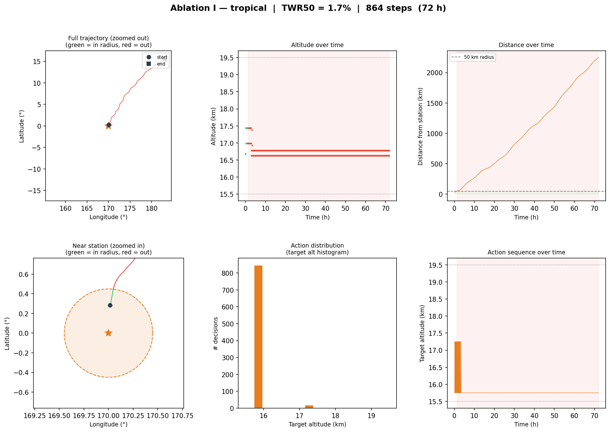 | 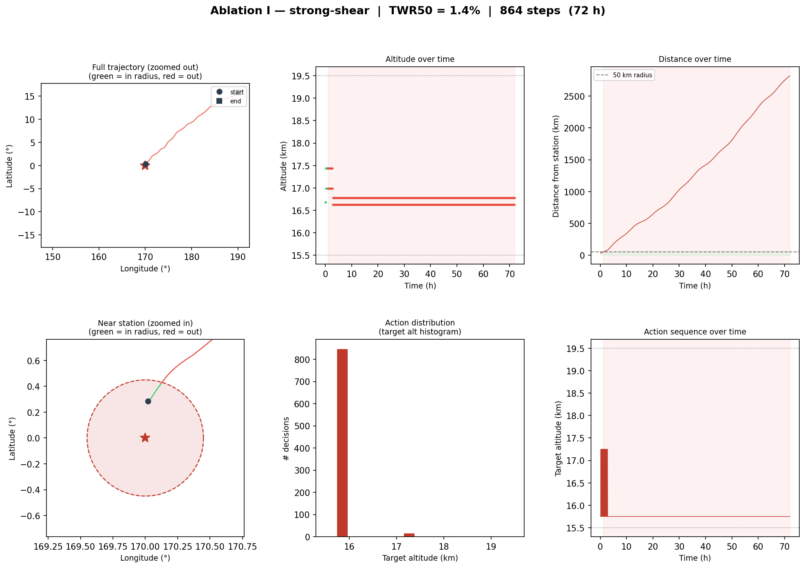 | 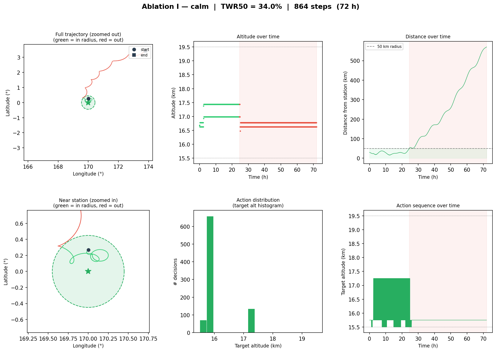 |

### Ablation J (recovery spawn)

| tropical | strong-shear | calm |
|----------|-------------|------|
| 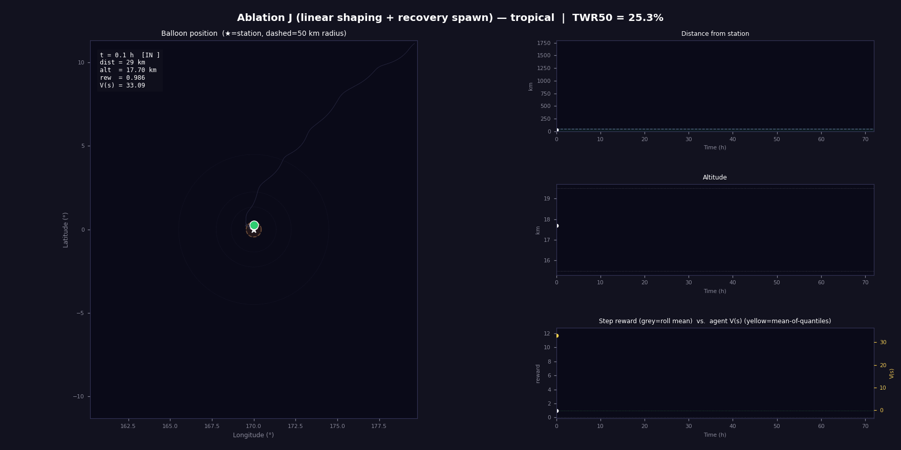 | 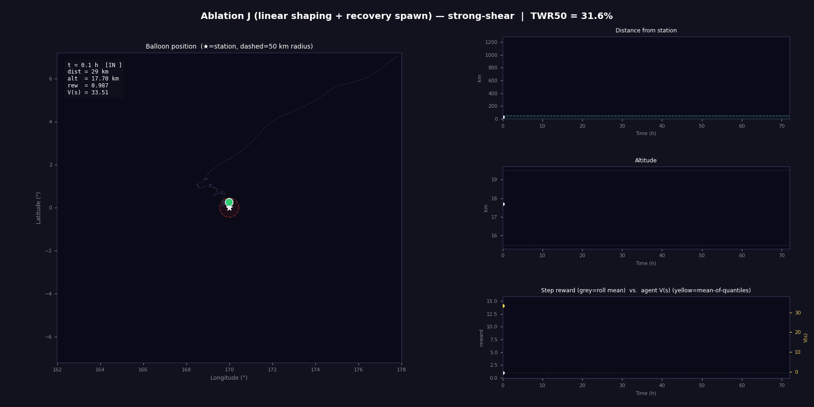 | 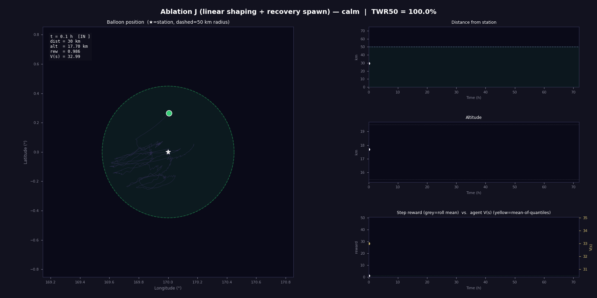 |

### Ablation K2 (exponential shaping, τ=500km)

| tropical | strong-shear | calm |
|----------|-------------|------|
| 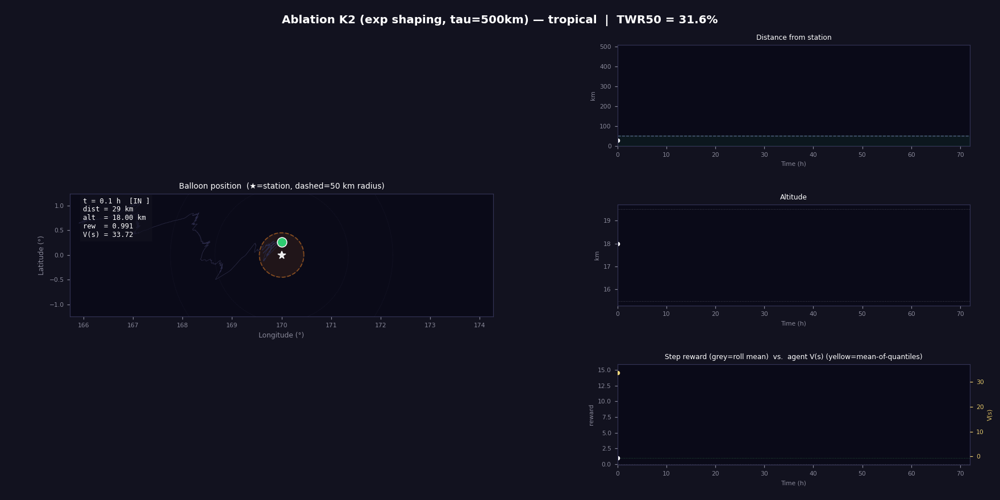 | 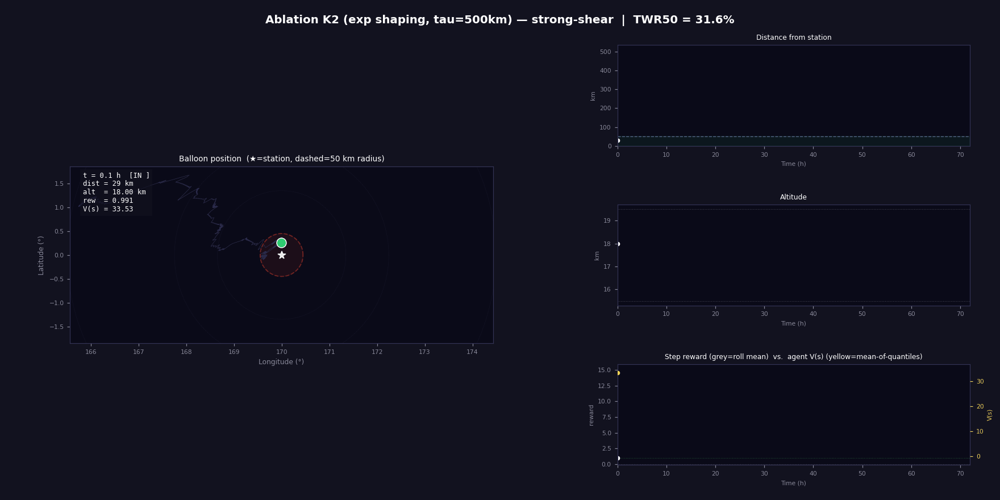 | 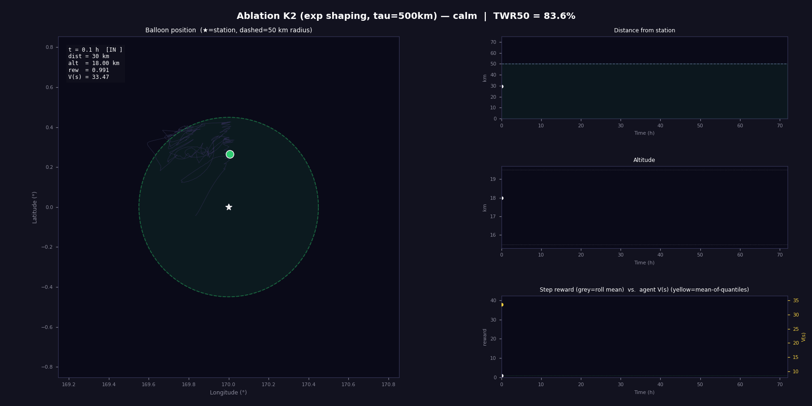 |

### Ablation L (Fourier time features)

| tropical | strong-shear | calm |
|----------|-------------|------|
| 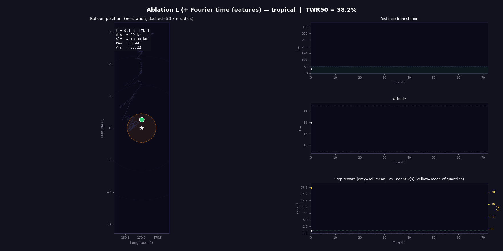 | 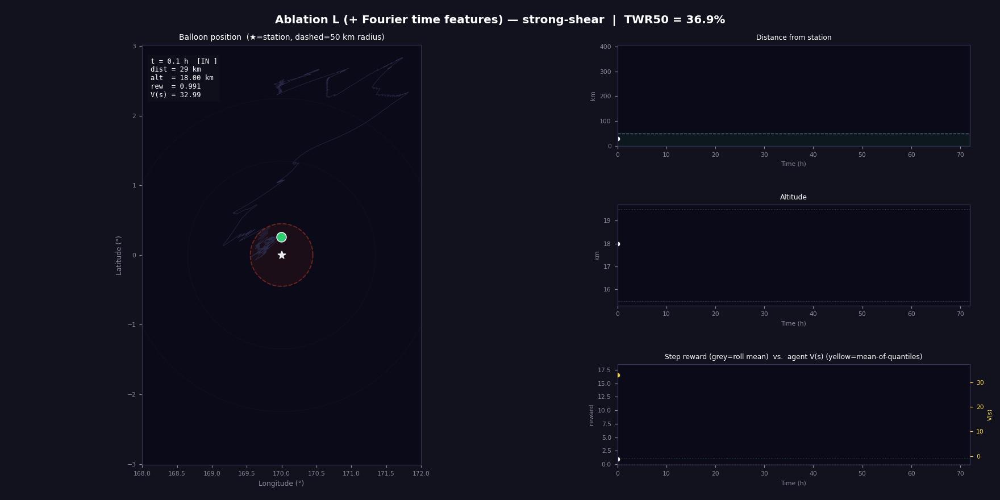 | 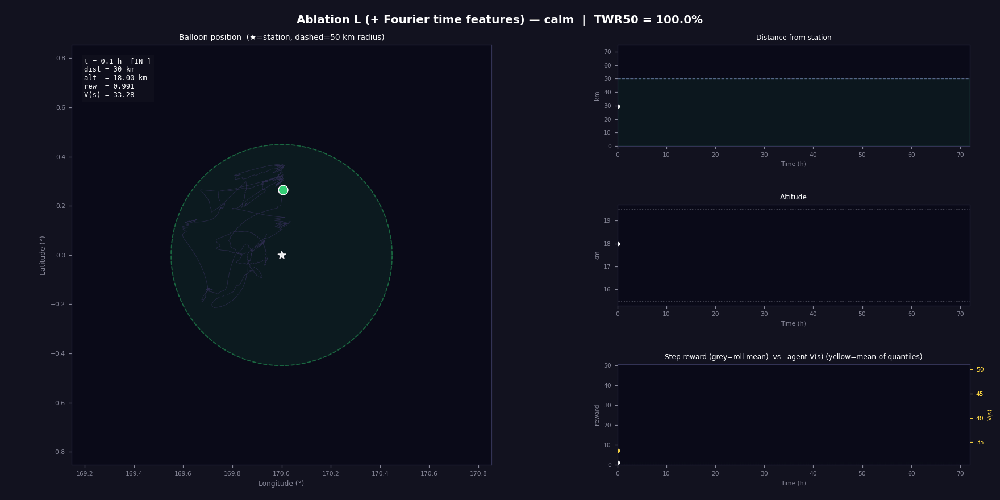 |

### Ablation M (option-critic + GRU-64)

| tropical | strong-shear | calm |
|----------|-------------|------|
| 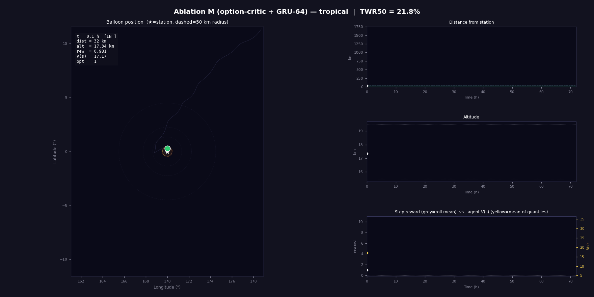 | 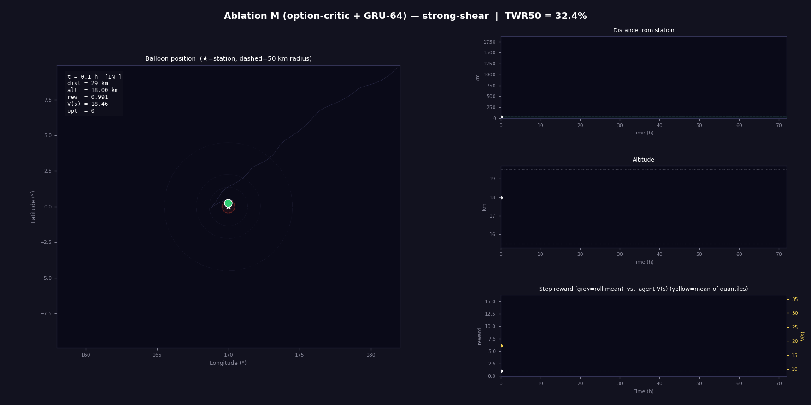 | 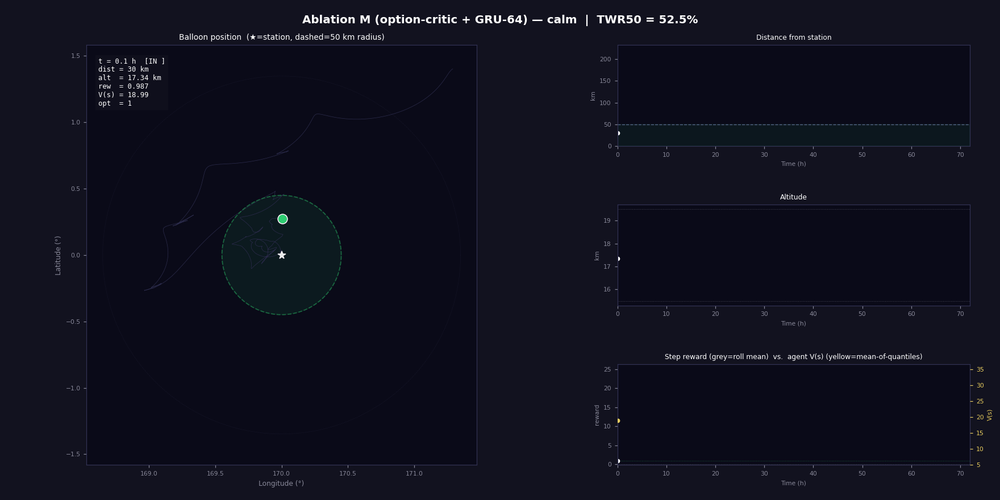 |

### Ablation N (γ=0.99 + curriculum rebalance)

| tropical | strong-shear | calm |
|----------|-------------|------|
|  | 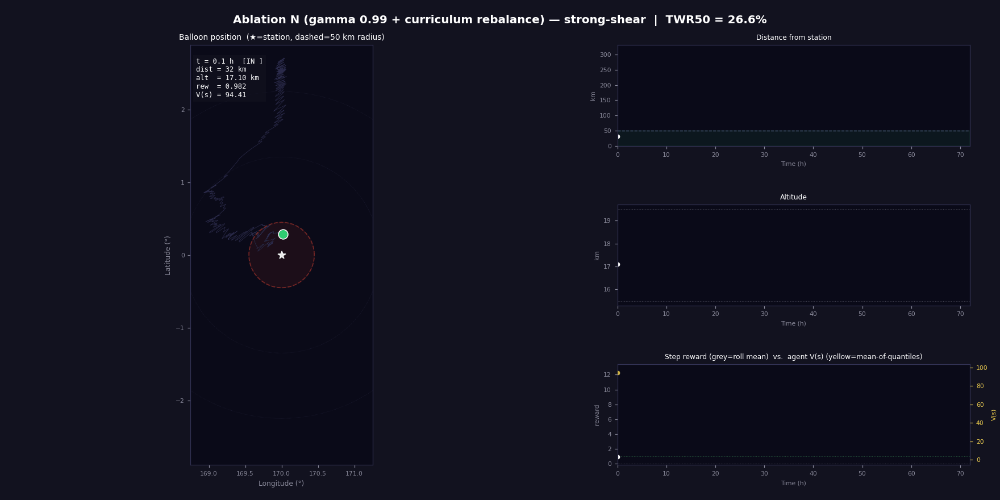 | 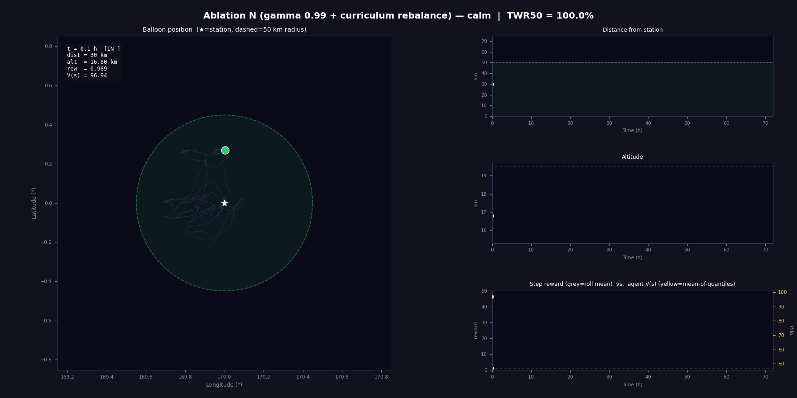 |
